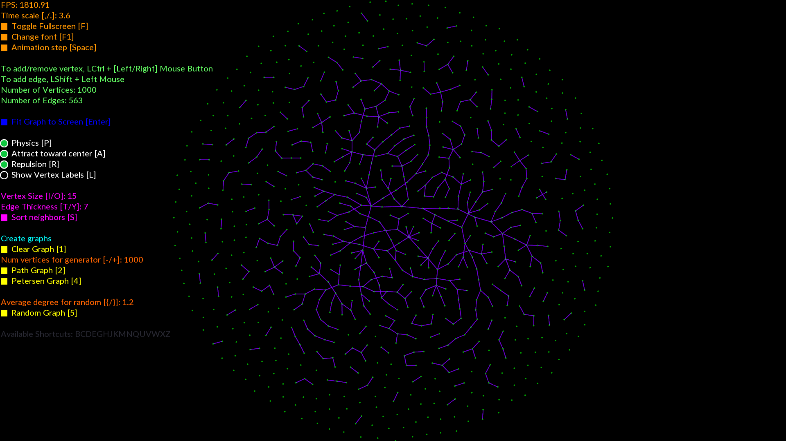

# Intro

This is graph-algorithm-visualization software made for my students at ENES Morelia. You can use it for your own purposes if you happen to find it, but bear in mind it's not finished yet.

# Dependencies:
	git
	cmake
	clang or gcc
	Google test
	SFML
	boost

# Para ubuntu 16.04:

`wget https://raw.githubusercontent.com/mraggi/Graph/master/install_ubuntu1604.sh && chmod +x install_ubuntu1604.sh && ./install_ubuntu1604.sh`

# Para ubuntu 17.10:

`wget https://raw.githubusercontent.com/mraggi/Graph/master/install_ubuntu1710.sh && chmod +x install_ubuntu1710.sh && ./install_ubuntu1710.sh`

# Para manjaro/arch

`wget https://raw.githubusercontent.com/mraggi/Graph/master/install_arch.sh && chmod +x install_arch.sh && ./install_arch.sh`

# Screenshots

